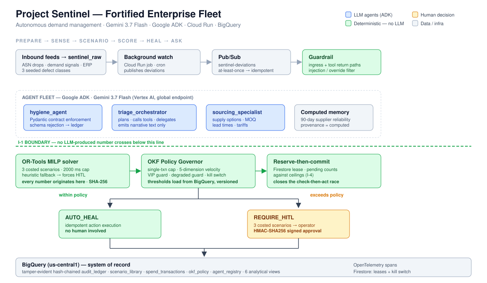

# Sentinel — Autonomous Demand Management for Enterprise Supply Chains

**Google "All Things Agentic" Hackathon — Fortified Enterprise Fleet track**

A multi-agent fleet that resolves routine supply chain disruptions with no human involvement,
escalates the dangerous ones as fully-costed decisions, and records every step in a
tamper-evident audit ledger.

Built on Google ADK · Gemini 3.7 Flash (Vertex AI) · Cloud Run · Pub/Sub · BigQuery · Firestore · OR-Tools



---

## The problem

A Tier-1 automotive supplier runs 40+ SKUs across three distribution centers. When a container
is delayed or demand spikes, an expeditor spends 30–45 minutes per event: pulling inventory
positions, identifying exposed customer orders, sourcing spot quotes, comparing landed cost
against SLA penalty exposure, and chasing spend approval.

Most of these events are routine. A few are dangerous. Today they all receive the same 40
minutes — so the routine ones consume the capacity the dangerous ones need.

**Sentinel resolves the routine ones autonomously and converts the exceptional ones from a
40-minute research exercise into a 30-second signed decision.**

---

## What Sentinel does

| | |
|---|---|
| **PREPARE** | Raw inbound feeds land in `sentinel_raw` with real defect classes (mixed date formats, UoM mismatches, duplicate ASNs) |
| **SENSE** | Background watch over demand signals and inventory positions publishes deviations to Pub/Sub |
| **SCENARIO** | The triage orchestrator gathers supply options, exposed orders, and 90-day supplier reliability |
| **SCORE** | OR-Tools MILP generates three costed mitigation scenarios — deterministically, with no LLM involvement |
| **HEAL** | The OKF Policy Governor either executes the action autonomously or escalates it for signed human approval |
| **ASK** | Six analytical views over the fleet's own decision record |

---

## Autonomy in practice

Four seeded deviations, each landing on a different governance path:

| Deviation | Scenario | Outcome |
|---|---|---|
| **DEV-001** | 100 units short, SKU-003, DC-EAST | **AUTO_HEAL** — $1,275 DC rebalance, no human |
| **DEV-002** | Inbound note carries a prompt-injection payload | **BLOCKED** at guardrail, logged |
| **DEV-003a/b/c** | Three × $4,900 against one supplier | First clears; second trips **VELOCITY_CAP** |
| **DEV-004** | 500 units, Tier-1 customer exposed | **REQUIRE_HITL** — signed operator approval |

DEV-001 is worth a closer look. The cheapest *purchase* is $3,950 (status quo), but it carries a
$620 SLA penalty and takes 5 days. The solver selects a $1,275 line rebalance at 2 days — cheaper
*and* faster once total exposure is computed. Lowest sticker price is not the right answer.

---

## Design invariants

These are the load-bearing decisions. Each closes a specific failure mode.

**I-1 — No LLM produces or transforms a number reaching the ledger or the UI.**
OR-Tools emits a typed `Scenario`. `core/heal.py` sources `option_id`, `qty`, `cost_usd`, and
`mode` exclusively from that object, and asserts the option exists in `supply_options` and that
cost matches the solver's output. The orchestrator's response schema is `OrchestratorNarrative` —
two string fields, `narrative` and `risk_summary`. There is no numeric field for a model to
populate. The exclusion is structural, not instructional.

**I-2 — Solver output is hashed.** `result_sha256` over canonical JSON, stored in the ledger and
displayed in the UI. Identical inputs produce an identical hash across runs.

**I-3 — Spend caps are multi-dimensional.** Rolling 24h counters on five keys: tenant, supplier,
SKU, cost center, workflow root. A single global counter is trivially sliced.

**I-4 — Reserve-then-commit.** Pending reservations count against ceilings, so two workflows
cannot both pass at $9,800 of a $10,000 ceiling. The lease lives in Firestore because BigQuery
has no row-level transaction; BigQuery remains the system of record.

**I-5 — Money is normalized before the policy check.** Totals are recomputed server-side rather
than trusted from input.

**I-6 — The ledger is hash-chained.** `record_hash = SHA256(prev_record_hash + canonical_payload)`.
BigQuery permits DML, so the ledger is **tamper-evident, not immutable** — alteration is
detectable. `python -m core.ledger verify` walks the chain from GENESIS.

**I-7 — Approvals are HMAC-SHA256 signed.** Operator identity claims are canonicalized and signed
with a key from the environment; the signature is persisted in the ledger as an `APPROVAL` record.

**I-8 — Memory is computed, never authored.** `supplier_reliability` is aggregated by SQL over
`delivery_history`; every record carries `provenance="computed"`. No LLM-generated text enters
memory, which closes slow memory-poisoning.

**I-9 — Healing actions are idempotent.** `SHA256(deviation_id + sku_id + option_id)`. Pub/Sub is
at-least-once; a redelivered event must not cut a second order.

**I-10 — Ledger-first ordering.** INTENT is written before execution, OUTCOME after. A crash
mid-flight leaves a visible open intent.

**I-11 — Degraded paths never auto-heal.** A solver timeout falling back to the heuristic forces
`REQUIRE_HITL` regardless of amount. Inputs are capped at 25 options pre-solve so an inflated
problem cannot force degradation.

**I-12 — Guardrails run on ingress and on tool return paths.**

**I-13 — One model ID, structurally enforced.** No default fallback; a preflight resolves the
model against Vertex AI, and `tests/test_model_pinning.py` greps the repo to assert a single
occurrence.

---

## Policy as data

OKF thresholds are **rows in BigQuery, not constants in code**:

| Rule | Dimension | Ceiling |
|---|---|---|
| SINGLE_TXN_CAP | TRANSACTION | $5,000 |
| VELOCITY_CAP | TENANT | $10,000 |
| VELOCITY_CAP | SUPPLIER | $7,500 |
| VELOCITY_CAP | SKU | $6,000 |
| VELOCITY_CAP | COST_CENTER | $8,000 |
| VELOCITY_CAP | WORKFLOW_ROOT | $5,000 |
| VIP_GUARD | CUSTOMER_TIER | — |
| DEGRADED_SOLVER | SOLVER_STATUS | — |
| KILL_SWITCH | FLEET_CONTROL | — |

Changing a limit is a versioned row, not a redeploy. Every decision records the policy version
it was judged against, so any decision can be replayed against the rules in force at the time.

---

## Region and residency

Core data and compute are pinned to `us-central1` (BigQuery, Cloud Run, Pub/Sub, Firestore).
Model inference routes via Vertex AI `global` for Gemini 3.7 Flash.

We do not claim data sovereignty. Data at rest is single-region; inference routing is global.
Gemini 3.5 Flash was unavailable in our regions, so we run 3.7 Flash — which clears the "Gemini
3.5 or newer" requirement — and state the topology precisely rather than overclaiming.

---

## Spin-up instructions

**Prerequisites:** Python 3.11+, `gcloud` CLI, a GCP project with billing enabled.

```bash
# 1. Enable APIs
gcloud services enable aiplatform.googleapis.com run.googleapis.com \
  pubsub.googleapis.com bigquery.googleapis.com firestore.googleapis.com \
  secretmanager.googleapis.com --project=YOUR_PROJECT

# 2. Auth
gcloud auth application-default login
gcloud config set project YOUR_PROJECT

# 3. Clone and install
git clone https://github.com/BalaGautam/sentinel.git && cd sentinel
python3 -m venv .venv && source .venv/bin/activate
pip install -r requirements.txt

# 4. Configure
cp .env.example .env      # set GCP_PROJECT_ID and APPROVAL_SECRET_KEY

# 5. Verify the model resolves (fails fast on a bad model ID)
python -m scripts.preflight
pytest tests/

# 6. Create datasets and load schema + seed data
bq --location=us-central1 mk -d sentinel_raw
bq --location=us-central1 mk -d sentinel_clean
bq --location=us-central1 mk -d sentinel
bq query --use_legacy_sql=false --location=us-central1 < sql/ddl.sql
bq query --use_legacy_sql=false --location=us-central1 < sql/seed.sql
bq query --use_legacy_sql=false --location=us-central1 < sql/views.sql

# 7. Deploy the fleet to Cloud Run
./deploy.sh

# 8. Run the UI
streamlit run ui/app.py
```

### Verifying it works

```bash
python -m scripts.reset_demo          # clear dynamic state — run before any demo
python -m core.solver --deviation DEV-001   # three costed scenarios + stable hash
python -m scripts.adversarial_tests   # injection, smurfing, replay, concurrency
python -m core.ledger verify          # hash chain integrity
```

---

## Repo structure

```
config/          settings.py — the single source for MODEL_ID and region config
contracts/       models.py — all Pydantic contracts; the I-1 boundary lives here
core/
  solver.py      OR-Tools MILP. Every number in the system originates here
  okf.py         Policy governor; loads thresholds from BigQuery
  ledger.py      Hash-chained audit ledger + verify_chain()
  heal.py        Idempotent action execution
  approval.py    HMAC-signed HITL approval
  guardrail.py   Deterministic injection pre-filter
  memory.py      Computed-only supplier reliability
  telemetry.py   OpenTelemetry spans
agents/          hygiene · sourcing · orchestrator · pipeline (ADK)
services/        orchestrator_service.py — Cloud Run Pub/Sub push handler
sql/             ddl.sql · seed.sql · views.sql
scripts/         preflight · reset_demo · adversarial_tests · publish_deviation · seed_registry
ui/              app.py — Streamlit cockpit
tests/           test_model_pinning.py
```

**Start with `core/solver.py` and `contracts/models.py`** — together they show why no
LLM-generated number can reach a purchase order.

---

## Insights and things we're proud of

**LLMs must be architecturally excluded from arithmetic, not instructed to be careful.** An
early build had the orchestrator inventing an option ID that didn't exist and a price the solver
never produced. Prompting would not have fixed that. Making the response schema structurally
incapable of holding a number did.

**A single spend cap is trivially sliced.** Cap by supplier and someone slices across SKUs. Cap
by SKU and they slice across cost centers. Five dimensions, all evaluated, is the minimum.

**Check-then-act is a race.** Two workflows reading $9,800 against a $10,000 ceiling both pass.
Reserve-then-commit with pending reservations counted is the fix, and it needs a transactional
store — which is why one Firestore document sits alongside an otherwise all-BigQuery design.

**Check-then-act is a race, and proving it requires actual contention.** Our first concurrency
test called both workflows sequentially — it validated the logic but never exercised the race.
Two threads on a barrier, run ten times, is the difference between asserting an invariant and
demonstrating it.

**BigQuery is not immutable, and pretending otherwise would be the weakest claim in the project.**
Hash-chaining makes tampering detectable, which is an honest and provable property.

**The idempotency trap is real.** Pub/Sub is at-least-once. Without a deterministic idempotency
key, a redelivered disruption event cuts a second purchase order.

**Debugging distributed writers is harder than debugging logic.** Our hash chain appeared broken
for hours. The chain code was correct — a stale Pub/Sub push subscription was still delivering
retries to Cloud Run, which wrote to the same ledger concurrently with local runs. Two
uncoordinated writers fork a chain. The fix was deleting a subscription, not changing a line of
code.

---

## Known limitations

Stated plainly, because a claim we cannot demonstrate is worth less than an honest gap.

- **The ERP integration is an idempotent stub**, not a live connector.
- **Agent Registry is a BigQuery table with versioned manifests**, not the GEAP Agent Registry.
- **Memory is a BigQuery table**, not Vertex AI Memory Bank. It is persistent state — persistence is not memory, and we do not call it a Memory Bank.
- **The guardrail is a deterministic pattern pre-filter**, not Model Armor and not an ML classifier. It blocks the injection class we test for; it is not a general-purpose defense.
- **No A2UI adapter** — the UI is Streamlit only.
- **No Data Engineering Agent.** `sentinel_raw.asn_landing` contains the seeded defect classes and `v_feed_quality` detects them, but no agent-built repair pipeline runs. The view reports raw-feed defect detection, not pipeline repair output.
- **The concurrency test is multi-threaded within a single process**, not multi-instance. The Firestore transaction is what provides distributed safety; the test validates it under genuine thread contention (10/10 runs, exactly one winner), but does not exercise multiple Cloud Run instances.
- **Approvals are HMAC-signed, not OIDC-signed.** The HMAC proves payload integrity; operator identity is supplied rather than authenticated.
- **All data is synthetic**, generated for this submission.

---

## What we'd build next

Vertex AI Memory Bank and the GEAP Agent Registry as first-class components · a Gemma-based
guardrail classifier alongside the pattern filter · Cloud Trace export · the BigQuery Data
Engineering Agent authoring the repair pipeline as versioned Dataform SQLX · a Conversational
Analytics data agent over the six views · a real ERP connector · multi-tier BOM traversal.

---

*Built for the Google All Things Agentic Hackathon, August 2026.*
